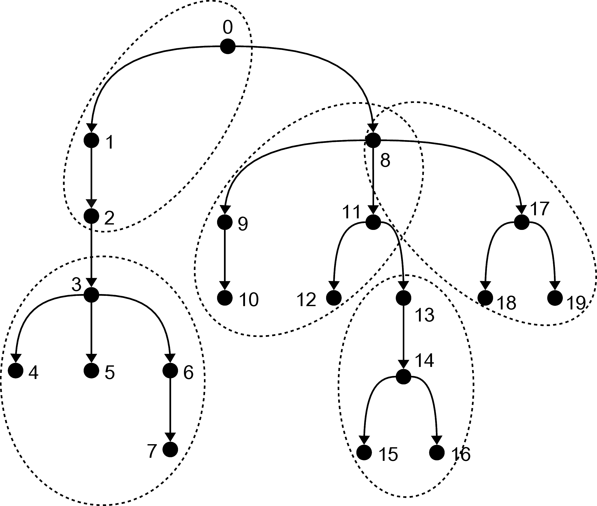

# A new tinear-time algorithm for centroid decomposition

The centroid of a tree is a node that, when removed, breaks the tree in connected components of size at most half of that of the original tree. By recursing this procedure on the components, one obtains the centroid decomposition of the tree, also known as centroid tree. The centroid tree has logarithmic height and its construction is a powerful pre-processing step in several tree-processing algorithms. The folklore recursive algorithm for computing the centroid tree runs in <code>O(n*log(n))</code> time. To the best of our knowledge, the only result claiming <code>O(n)</code> time is unpublished and relies on (dynamic) heavy path decomposition of the original tree. In this repository, we include our implementation for the new linear-time algorithm that we proposed, based on the idea of applying the folklore algorithm to a suitable decomposition of the original tree.

